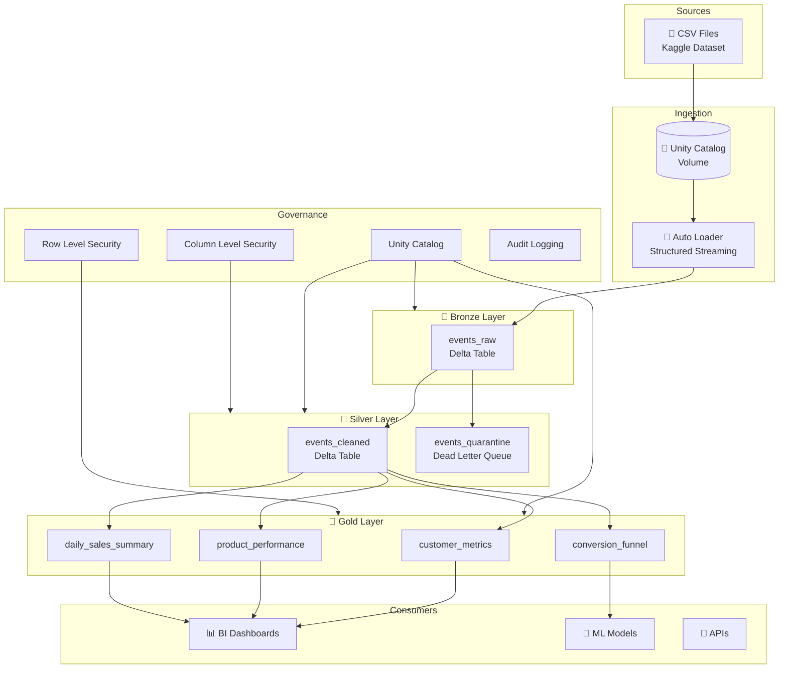
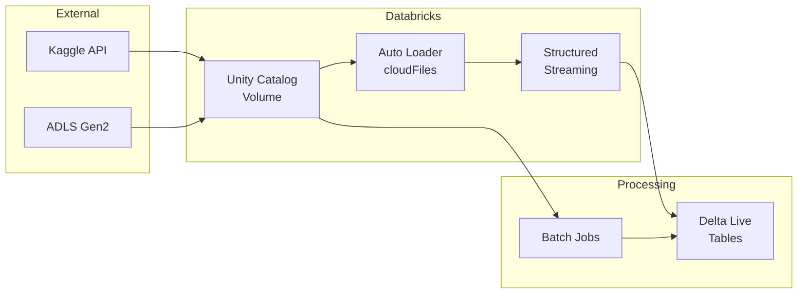
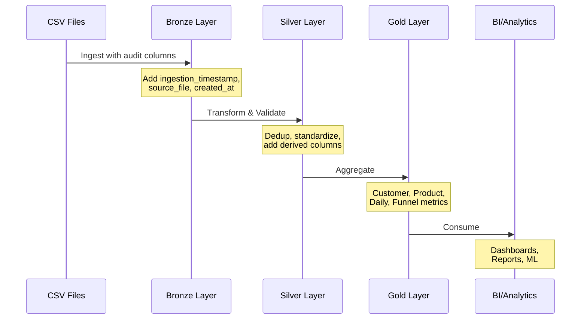
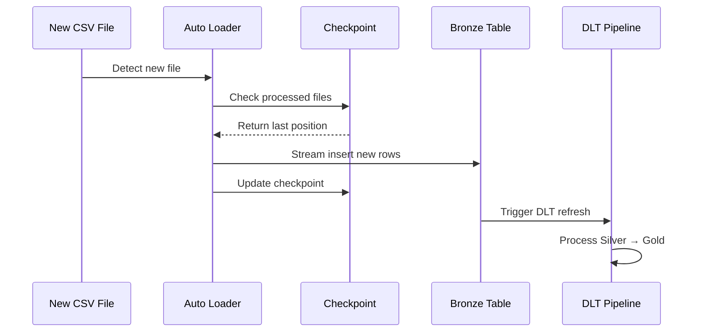
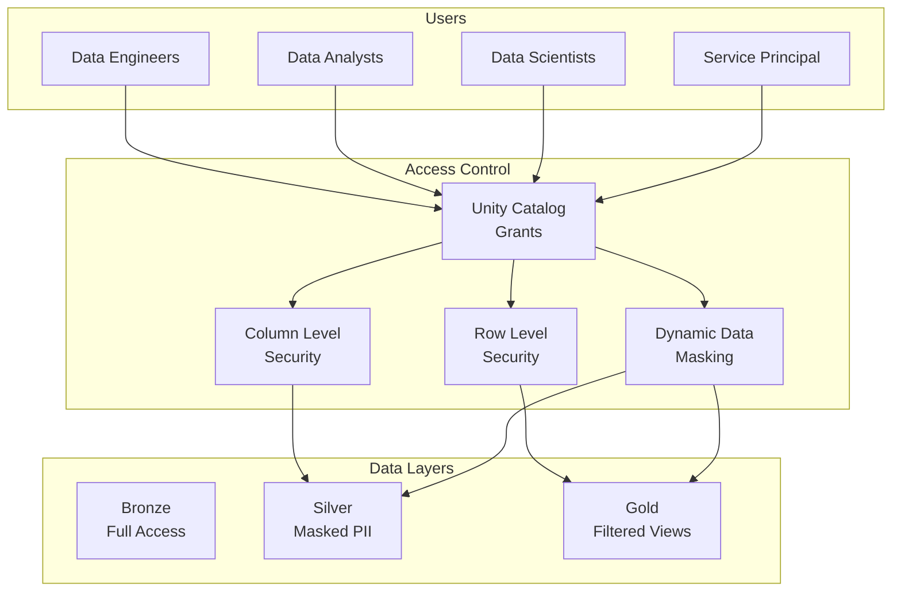
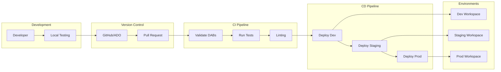
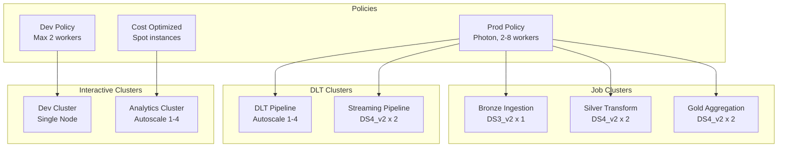
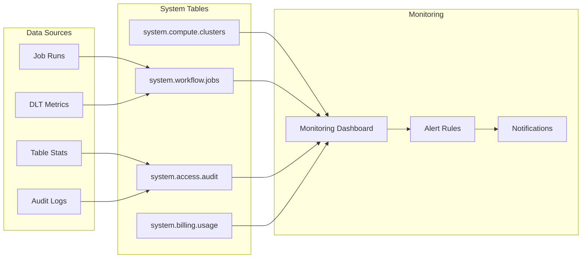
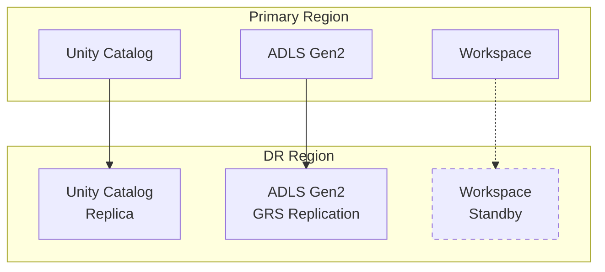

# E-Commerce Analytics Platform - Architecture

## Overview

This document describes the architecture of the E-Commerce Analytics Platform built on Azure Databricks with Unity Catalog governance.

## High-Level Architecture



## Component Architecture

### Data Ingestion Layer



### Unity Catalog Structure

```
ecommerce_analytics_${environment}/
│
├── bronze_layer/                    # Raw data schema
│   ├── events_raw                   # Raw events table (partitioned by event_type)
│   ├── raw_data/                    # Volume - CSV files
│   └── _checkpoints/                # Volume - Streaming checkpoints
│
├── silver_layer/                    # Cleaned data schema
│   ├── events_cleaned               # Cleaned events (partitioned by event_date)
│   └── events_quarantine            # Failed quality check records
│
├── gold_layer/                      # Business metrics schema
│   ├── customer_metrics             # Customer-level aggregations
│   ├── product_performance          # Product-level metrics
│   ├── daily_sales_summary          # Daily time-series
│   └── conversion_funnel            # Funnel analysis
│
└── dlt_silver_layer/                # DLT-managed tables
    └── (DLT creates tables here)
```

## Data Flow Architecture

### Batch Processing Flow



### Streaming Processing Flow



## Security Architecture



## Deployment Architecture

### CI/CD Pipeline



### Databricks Asset Bundles Structure

```
ecommerce-analytics-platform/
├── databricks.yml           # Main bundle configuration
├── environments/
│   ├── dev.yml              # Dev environment variables
│   ├── staging.yml          # Staging environment variables
│   └── prod.yml             # Prod environment variables
├── resources/
│   ├── jobs.yml             # Workflow job definitions
│   ├── pipelines.yml        # DLT pipeline definitions
│   └── clusters.yml         # Cluster configurations
└── src/                     # Notebooks and code
```

## Compute Architecture



## Monitoring Architecture



## Performance Considerations

### Data Partitioning Strategy

| Layer  | Table               | Partition Column | Rationale                        |
| ------ | ------------------- | ---------------- | -------------------------------- |
| Bronze | events_raw          | event_type       | Balance cardinality (4 values)   |
| Silver | events_cleaned      | event_date       | Time-based queries, data pruning |
| Gold   | daily_sales_summary | N/A              | Small table, no partition needed |

### Optimization Techniques

1. **Z-Ordering**: Applied on frequently filtered columns
2. **Auto Optimize**: Enabled for all Delta tables
3. **Data Skipping**: Leveraging min/max statistics
4. **Caching**: Enabled for frequently accessed tables
5. **Photon**: Enabled for production workloads

## Disaster Recovery



### Recovery Objectives

| Metric                         | Target                  |
| ------------------------------ | ----------------------- |
| RPO (Recovery Point Objective) | 1 hour                  |
| RTO (Recovery Time Objective)  | 4 hours                 |
| Data Retention                 | 30 days (time travel)   |
| Backup Frequency               | Continuous (Delta logs) |
