# E-Commerce Analytics Platform - Architecture

## Overview

This document describes the architecture of the E-Commerce Analytics Platform built on Azure Databricks with Unity Catalog governance.

## High-Level Architecture

```mermaid
flowchart TB
    subgraph Sources
        CSV[📄 CSV Files<br/>Kaggle Dataset]
    end

    subgraph Ingestion
        AL[🔄 Auto Loader<br/>Structured Streaming]
        UC_VOL[(📁 Unity Catalog<br/>Volume)]
    end

    subgraph Bronze["🥉 Bronze Layer"]
        B_RAW[events_raw<br/>Delta Table]
    end

    subgraph Silver["🥈 Silver Layer"]
        S_CLEAN[events_cleaned<br/>Delta Table]
        S_QUAR[events_quarantine<br/>Dead Letter Queue]
    end

    subgraph Gold["🥇 Gold Layer"]
        G_CUST[customer_metrics]
        G_PROD[product_performance]
        G_DAILY[daily_sales_summary]
        G_FUNNEL[conversion_funnel]
    end

    subgraph Governance
        UC[Unity Catalog]
        RLS[Row Level Security]
        CLS[Column Level Security]
        AUDIT[Audit Logging]
    end

    subgraph Consumers
        BI[📊 BI Dashboards]
        ML[🤖 ML Models]
        API[🔌 APIs]
    end

    CSV --> UC_VOL
    UC_VOL --> AL
    AL --> B_RAW
    B_RAW --> S_CLEAN
    B_RAW --> S_QUAR
    S_CLEAN --> G_CUST
    S_CLEAN --> G_PROD
    S_CLEAN --> G_DAILY
    S_CLEAN --> G_FUNNEL

    G_CUST --> BI
    G_PROD --> BI
    G_DAILY --> BI
    G_FUNNEL --> ML

    UC --> Bronze
    UC --> Silver
    UC --> Gold
    RLS --> Gold
    CLS --> Silver
```



## Component Architecture

### Data Ingestion Layer


### Unity Catalog Structure

```
ecommerce_analytics_${environment}/
│
├── bronze_layer/                    # Raw data schema
│   ├── events_raw                   # Raw events table (partitioned by event_type)
│   ├── raw_data/                    # Volume - CSV files
│   └── _checkpoints/                # Volume - Streaming checkpoints
│
├── silver_layer/                    # Cleaned data schema
│   ├── events_cleaned               # Cleaned events (partitioned by event_date)
│   └── events_quarantine            # Failed quality check records
│
├── gold_layer/                      # Business metrics schema
│   ├── customer_metrics             # Customer-level aggregations
│   ├── product_performance          # Product-level metrics
│   ├── daily_sales_summary          # Daily time-series
│   └── conversion_funnel            # Funnel analysis
│
└── dlt_silver_layer/                # DLT-managed tables
    └── (DLT creates tables here)
```

## Data Flow Architecture

### Batch Processing Flow


### Streaming Processing Flow

```mermaid
sequenceDiagram
    participant Source as New CSV File
    participant AL as Auto Loader
    participant Checkpoint as Checkpoint
    participant Bronze as Bronze Table
    participant DLT as DLT Pipeline

    Source->>AL: Detect new file
    AL->>Checkpoint: Check processed files
    Checkpoint-->>AL: Return last position
    AL->>Bronze: Stream insert new rows
    AL->>Checkpoint: Update checkpoint
    Bronze->>DLT: Trigger DLT refresh
    DLT->>DLT: Process Silver → Gold
```



## Security Architecture


## Deployment Architecture

### CI/CD Pipeline


### Databricks Asset Bundles Structure

```
ecommerce-analytics-platform/
├── databricks.yml           # Main bundle configuration
├── environments/
│   ├── dev.yml              # Dev environment variables
│   ├── staging.yml          # Staging environment variables
│   └── prod.yml             # Prod environment variables
├── resources/
│   ├── jobs.yml             # Workflow job definitions
│   ├── pipelines.yml        # DLT pipeline definitions
│   └── clusters.yml         # Cluster configurations
└── src/                     # Notebooks and code
```

## Compute Architecture


## Monitoring Architecture


## Performance Considerations

### Data Partitioning Strategy

| Layer  | Table               | Partition Column | Rationale                        |
| ------ | ------------------- | ---------------- | -------------------------------- |
| Bronze | events_raw          | event_type       | Balance cardinality (4 values)   |
| Silver | events_cleaned      | event_date       | Time-based queries, data pruning |
| Gold   | daily_sales_summary | N/A              | Small table, no partition needed |

### Optimization Techniques

1. **Z-Ordering**: Applied on frequently filtered columns
2. **Auto Optimize**: Enabled for all Delta tables
3. **Data Skipping**: Leveraging min/max statistics
4. **Caching**: Enabled for frequently accessed tables
5. **Photon**: Enabled for production workloads

## Disaster Recovery


### Recovery Objectives

| Metric                         | Target                  |
| ------------------------------ | ----------------------- |
| RPO (Recovery Point Objective) | 1 hour                  |
| RTO (Recovery Time Objective)  | 4 hours                 |
| Data Retention                 | 30 days (time travel)   |
| Backup Frequency               | Continuous (Delta logs) |
