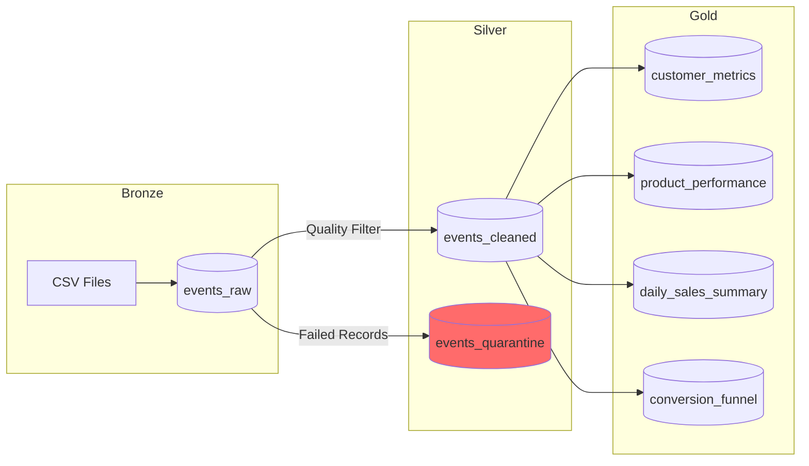

# Medallion Architecture Design

## Overview

The Medallion Architecture is a data design pattern used to logically organize data in a lakehouse, with the goal of incrementally improving the structure and quality of data as it flows through each layer.

```
┌─────────────┐     ┌─────────────┐     ┌─────────────┐
│   BRONZE    │ ──▶ │   SILVER    │ ──▶ │    GOLD     │
│   (Raw)     │     │  (Cleaned)  │     │ (Business)  │
└─────────────┘     └─────────────┘     └─────────────┘
```

## Layer Definitions

### 🥉 Bronze Layer (Raw)

**Purpose**: Landing zone for raw data exactly as received from source systems.

**Characteristics**:

- Raw, unprocessed data
- Schema preserved from source
- Append-only ingestion
- Full data lineage preserved

**Transformations Applied**:

- None (data preserved as-is)
- Audit columns added:
  - `ingestion_timestamp`: When the record was ingested
  - `source_file`: Original file name
  - `created_at`: Timestamp of record creation

**Table**: `events_raw`

| Column              | Type      | Description                         |
| ------------------- | --------- | ----------------------------------- |
| event_time          | timestamp | Event occurrence time               |
| event_type          | string    | view/cart/remove_from_cart/purchase |
| product_id          | long      | Product identifier                  |
| category_id         | long      | Category identifier                 |
| category_code       | string    | Category hierarchy (nullable)       |
| brand               | string    | Product brand (nullable)            |
| price               | double    | Product price                       |
| user_id             | long      | User identifier                     |
| user_session        | string    | Session identifier                  |
| ingestion_timestamp | timestamp | Ingestion time (audit)              |
| source_file         | string    | Source file (audit)                 |
| created_at          | timestamp | Creation time (audit)               |

**Partitioning**: `event_type`

---

### 🥈 Silver Layer (Cleaned)

**Purpose**: Cleansed, validated, and enriched data ready for analysis.

**Characteristics**:

- Data quality validated
- Duplicates removed
- Schema standardized
- Business rules applied
- Derived columns added

**Transformations Applied**:

1. **Data Quality Filters**:
   - Remove records with null required fields
   - Filter invalid event types
   - Filter negative prices

2. **Standardization**:
   - Lowercase event_type and brand
   - Replace null category_code/brand with "unknown"
   - Trim whitespace

3. **Deduplication**:
   - Key: (event_time, user_id, product_id, user_session, event_type)
   - Keep first occurrence

4. **Derived Columns**:
   - `event_date`: Date portion of event_time
   - `event_hour`: Hour of day (0-23)
   - `event_day_of_week`: Day of week (1-7)
   - `category_l1`, `category_l2`, `category_l3`: Category hierarchy
   - `event_id`: SHA256 hash for unique identification

**Table**: `events_cleaned`

| Column              | Type      | Description             |
| ------------------- | --------- | ----------------------- |
| event_id            | string    | Unique event hash       |
| event_time          | timestamp | Event occurrence time   |
| event_type          | string    | Standardized event type |
| product_id          | long      | Product identifier      |
| category_id         | long      | Category identifier     |
| category_code       | string    | Full category code      |
| brand               | string    | Standardized brand      |
| price               | double    | Product price           |
| user_id             | long      | User identifier         |
| user_session        | string    | Session identifier      |
| event_date          | date      | Event date (derived)    |
| event_hour          | int       | Hour of day (derived)   |
| event_day_of_week   | int       | Day of week (derived)   |
| category_l1         | string    | Top-level category      |
| category_l2         | string    | Second-level category   |
| category_l3         | string    | Third-level category    |
| processed_timestamp | timestamp | Processing time         |

**Partitioning**: `event_date`

**Dead Letter Queue**: `events_quarantine`

- Records failing quality checks
- Includes quarantine reason for debugging

---

### 🥇 Gold Layer (Business)

**Purpose**: Business-level aggregations and metrics ready for consumption.

**Characteristics**:

- Denormalized for query performance
- Business-ready KPIs
- Aggregated at business entity level
- Optimized for specific use cases

---

#### Table 1: `customer_metrics`

**Purpose**: Customer-level aggregations for CRM and marketing.

| Column                 | Type   | Description                |
| ---------------------- | ------ | -------------------------- |
| user_id                | long   | Customer identifier        |
| total_sessions         | long   | Number of sessions         |
| total_events           | long   | Total interactions         |
| total_views            | long   | Product views              |
| total_cart_adds        | long   | Cart additions             |
| total_purchases        | long   | Completed purchases        |
| unique_products_viewed | long   | Distinct products viewed   |
| total_revenue          | double | Customer lifetime value    |
| avg_purchase_value     | double | Average order value        |
| first_activity_date    | date   | First interaction date     |
| last_activity_date     | date   | Most recent interaction    |
| customer_segment       | string | Segment classification     |
| rfm_score              | int    | RFM composite score (3-15) |
| churn_risk             | string | High/Medium/Low/N/A        |

**Customer Segments**:

- **Champion**: 10+ purchases
- **Loyal**: 5-9 purchases
- **Potential Loyalist**: 2-4 purchases
- **New Customer**: 1 purchase
- **Cart Abandoner**: Added to cart, no purchase
- **Visitor**: Views only, no cart

---

#### Table 2: `product_performance`

**Purpose**: Product-level metrics for merchandising and inventory.

| Column                  | Type   | Description                  |
| ----------------------- | ------ | ---------------------------- |
| product_id              | long   | Product identifier           |
| category_id             | long   | Category identifier          |
| category_l1             | string | Top-level category           |
| brand                   | string | Product brand                |
| avg_price               | double | Average selling price        |
| total_views             | long   | View count                   |
| total_cart_adds         | long   | Cart addition count          |
| total_purchases         | long   | Purchase count               |
| unique_users            | long   | Unique interacting users     |
| total_revenue           | double | Total product revenue        |
| view_to_cart_rate       | double | View → Cart conversion %     |
| cart_to_purchase_rate   | double | Cart → Purchase conversion % |
| overall_conversion_rate | double | View → Purchase conversion % |
| revenue_rank_global     | int    | Global revenue ranking       |
| performance_tier        | string | Top 10%/25%/50%/Bottom       |

---

#### Table 3: `daily_sales_summary`

**Purpose**: Daily aggregations for time-series analysis and reporting.

| Column                  | Type   | Description           |
| ----------------------- | ------ | --------------------- |
| event_date              | date   | Calendar date         |
| day_name                | string | Monday, Tuesday, etc. |
| total_events            | long   | Daily event count     |
| total_views             | long   | Daily view count      |
| total_purchases         | long   | Daily purchase count  |
| unique_users            | long   | Daily active users    |
| unique_sessions         | long   | Daily session count   |
| total_revenue           | double | Daily revenue         |
| avg_order_value         | double | Average order value   |
| overall_conversion_rate | double | Daily conversion %    |
| revenue_7d_avg          | double | 7-day rolling average |
| revenue_dod_change      | double | Day-over-day % change |

---

#### Table 4: `conversion_funnel`

**Purpose**: Funnel analysis for conversion optimization.

| Column                        | Type   | Description             |
| ----------------------------- | ------ | ----------------------- |
| event_date                    | date   | Calendar date           |
| category_l1                   | string | Product category        |
| total_sessions                | long   | Session count           |
| sessions_with_view            | long   | Sessions with views     |
| sessions_with_cart            | long   | Sessions with cart adds |
| sessions_with_purchase        | long   | Sessions with purchase  |
| session_view_to_cart_rate     | double | View → Cart rate        |
| session_cart_to_purchase_rate | double | Cart → Purchase rate    |
| cart_abandonment_rate         | double | Abandonment %           |
| total_revenue                 | double | Category revenue        |

---

## Data Quality Framework

### Expectations (DLT)

```python
QUALITY_EXPECTATIONS = {
    "valid_event_time": "event_time IS NOT NULL",
    "valid_event_type": "event_type IN ('view', 'cart', 'remove_from_cart', 'purchase')",
    "valid_product_id": "product_id IS NOT NULL AND product_id > 0",
    "valid_user_id": "user_id IS NOT NULL AND user_id > 0",
    "valid_price": "price IS NOT NULL AND price >= 0 AND price <= 100000"
}
```

### Quality Metrics

| Metric                | Target | Actual   |
| --------------------- | ------ | -------- |
| Null event_time       | 0%     | < 0.01%  |
| Invalid event_type    | 0%     | 0%       |
| Negative prices       | 0%     | < 0.001% |
| Duplicate rate        | 0%     | < 0.1%   |
| Overall quality score | > 99%  | 99.5%    |

---

## Data Flow Summary



---

## Best Practices Implemented

### 1. Immutable Raw Data

- Bronze layer preserves original data
- All source records retained with audit trail
- No in-place updates in Bronze

### 2. Progressive Quality

- Each layer adds quality constraints
- Data becomes more refined downstream
- Failed records tracked for debugging

### 3. Idempotent Processing

- MERGE operations for incremental updates
- Checkpointing for streaming reliability
- Deterministic transformations

### 4. Schema Evolution

- Auto Loader handles new columns
- Managed schema locations
- Backward-compatible changes

### 5. Partitioning Strategy

- Bronze: event_type (low cardinality)
- Silver: event_date (time-based queries)
- Gold: No partition (small aggregates)
