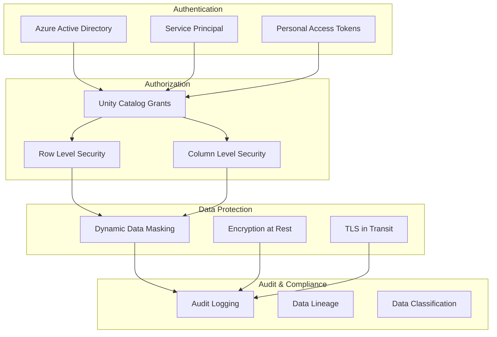
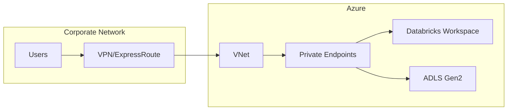
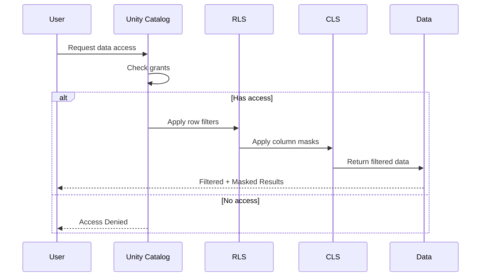

# Security Model Documentation

## Overview

This document describes the security model implemented for the E-Commerce Analytics Platform, including Unity Catalog governance, access control policies, and data protection mechanisms.

## Security Layers



## Identity and Access Management

### Authentication Methods

| Method                | Use Case          | Configuration      |
| --------------------- | ----------------- | ------------------ |
| Azure AD SSO          | Interactive users | Workspace SCIM     |
| Service Principal     | Automated jobs    | Client ID + Secret |
| Personal Access Token | API access        | Token management   |

### User Groups

| Group             | Description                  | Access Level               |
| ----------------- | ---------------------------- | -------------------------- |
| `data-engineers`  | Build and maintain pipelines | Full access to all layers  |
| `data-analysts`   | Consume data for analysis    | Read access to Gold layer  |
| `data-scientists` | Build ML models              | Read access to Silver/Gold |
| `admins`          | Platform administration      | Full admin access          |

## Unity Catalog Grants

### Catalog-Level Permissions

```sql
-- Development Catalog
GRANT USE CATALOG ON CATALOG ecommerce_analytics_dev
    TO `data-engineers`;
GRANT USE CATALOG ON CATALOG ecommerce_analytics_dev
    TO `data-analysts`;

-- Production Catalog (more restrictive)
GRANT USE CATALOG ON CATALOG ecommerce_analytics_prod
    TO `data-engineers`;
-- Analysts only get schema-level access
```

### Schema-Level Permissions

| Schema       | data-engineers | data-analysts | Service Principal |
| ------------ | -------------- | ------------- | ----------------- |
| bronze_layer | ALL PRIVILEGES | -             | ALL PRIVILEGES    |
| silver_layer | ALL PRIVILEGES | SELECT        | ALL PRIVILEGES    |
| gold_layer   | ALL PRIVILEGES | SELECT        | ALL PRIVILEGES    |

### Table-Level Permissions

```sql
-- Grant read access to specific gold tables
GRANT SELECT ON TABLE gold_layer.customer_metrics
    TO `data-analysts`;
GRANT SELECT ON TABLE gold_layer.product_performance
    TO `data-analysts`;
GRANT SELECT ON TABLE gold_layer.daily_sales_summary
    TO `data-analysts`;
```

## Row Level Security (RLS)

### Implementation

RLS filters rows based on user attributes, ensuring users only see data they're authorized to access.

#### User-Segment Mapping Table

```sql
CREATE TABLE user_segment_access (
    user_name STRING,
    customer_segment STRING,
    category_l1 STRING,
    is_admin BOOLEAN DEFAULT FALSE
);
```

#### RLS-Enabled View

```sql
CREATE VIEW customer_metrics_secured AS
SELECT *
FROM customer_metrics
WHERE check_segment_access(customer_segment) = TRUE;
```

### Access Matrix

| User                 | Segment Access  | Category Access |
| -------------------- | --------------- | --------------- |
| analyst1@company.com | Champion, Loyal | electronics     |
| analyst2@company.com | Champion        | appliances      |
| admin@company.com    | ALL             | ALL             |

## Column Level Security (CLS)

### PII Columns Identified

| Column               | Table  | Sensitivity | Protection             |
| -------------------- | ------ | ----------- | ---------------------- |
| user_id              | All    | High        | Mask for non-engineers |
| user_session         | Silver | Medium      | Partial mask           |
| (future: email)      | -      | High        | Full mask              |
| (future: IP address) | -      | High        | Hide                   |

### Implementation

```sql
CREATE VIEW customer_metrics_no_pii AS
SELECT
    -- user_id excluded
    total_sessions,
    total_events,
    customer_lifetime_value,
    customer_segment
FROM customer_metrics;

GRANT SELECT ON VIEW customer_metrics_no_pii TO `data-analysts`;
```

## Dynamic Data Masking

### Masking Functions

#### 1. User ID Masking (Partial)

```sql
CREATE FUNCTION mask_user_id(user_id BIGINT)
RETURNS STRING
RETURN CONCAT('****', RIGHT(CAST(user_id AS STRING), 4));

-- Input: 512563789
-- Output: ****3789
```

#### 2. Session ID Masking

```sql
CREATE FUNCTION mask_session(session_id STRING)
RETURNS STRING
RETURN CONCAT(LEFT(session_id, 8), '****');

-- Input: abc123-def456-ghi789
-- Output: abc123-d****
```

#### 3. Price Range Masking

```sql
CREATE FUNCTION mask_price(price DOUBLE)
RETURNS STRING
RETURN CASE
    WHEN price < 10 THEN '$0-$10'
    WHEN price < 50 THEN '$10-$50'
    WHEN price < 100 THEN '$50-$100'
    ELSE '$100+'
END;
```

### Role-Based Masking View

```sql
CREATE VIEW events_cleaned_masked AS
SELECT
    event_id,
    event_time,
    event_type,
    product_id,
    CASE
        WHEN is_member('data-engineers') THEN user_id
        ELSE CAST(mask_user_id(user_id) AS BIGINT)
    END AS user_id,
    CASE
        WHEN is_member('data-engineers') THEN user_session
        ELSE mask_session(user_session)
    END AS user_session,
    ...
FROM silver_layer.events_cleaned;
```

## Data Classification

### Sensitivity Tags

```sql
-- Apply tags to tables
ALTER TABLE silver_layer.events_cleaned
SET TAGS ('sensitivity' = 'confidential', 'contains_pii' = 'true');

-- Apply tags to columns
ALTER TABLE silver_layer.events_cleaned
ALTER COLUMN user_id SET TAGS ('pii' = 'true', 'mask_type' = 'partial');
```

### Classification Levels

| Level        | Description                  | Examples                      |
| ------------ | ---------------------------- | ----------------------------- |
| Public       | Non-sensitive, can be shared | Product names, categories     |
| Internal     | Internal use only            | Aggregated metrics            |
| Confidential | PII, requires access control | user_id, user_session         |
| Restricted   | Highly sensitive             | Payment data (not in dataset) |

## Audit Logging

### System Tables

Unity Catalog provides system tables for comprehensive audit logging:

```sql
-- Query data access events
SELECT
    event_time,
    user_identity.email,
    action_name,
    request_params.full_name_arg as table_name
FROM system.access.audit
WHERE action_name IN ('getTable', 'commandSubmit')
    AND request_params.full_name_arg LIKE '%ecommerce_analytics%'
ORDER BY event_time DESC;
```

### Tracked Events

| Event Type     | Description        | Retention |
| -------------- | ------------------ | --------- |
| getTable       | Table access       | 365 days  |
| commandSubmit  | Query execution    | 365 days  |
| createTable    | Table creation     | 365 days  |
| grantPrivilege | Permission changes | 365 days  |

### Monitoring Dashboard Queries

```sql
-- Daily data access summary
SELECT
    DATE(event_time) as access_date,
    COUNT(*) as total_queries,
    COUNT(DISTINCT user_identity.email) as unique_users
FROM system.access.audit
WHERE request_params.full_name_arg LIKE '%ecommerce_analytics%'
GROUP BY DATE(event_time)
ORDER BY access_date DESC;
```

## Encryption

### At Rest

- Delta tables encrypted with Azure Storage encryption
- Unity Catalog metadata encrypted
- DBFS encrypted with workspace-level keys

### In Transit

- TLS 1.2+ for all API communications
- Encrypted connections to external storage
- HTTPS required for all endpoints

## Compute Security

### Cluster Policies

Enforce security configurations through cluster policies:

```json
{
  "data_security_mode": {
    "type": "fixed",
    "value": "USER_ISOLATION"
  },
  "single_user_name": {
    "type": "regex",
    "pattern": ".*@company\\.com"
  }
}
```

### Data Security Modes

| Mode           | Description                  | Use Case                 |
| -------------- | ---------------------------- | ------------------------ |
| USER_ISOLATION | Each user runs in isolation  | Multi-user clusters      |
| SINGLE_USER    | Cluster assigned to one user | Interactive development  |
| NONE           | No Unity Catalog enforcement | Legacy (not recommended) |

## Network Security

### Recommended Configuration



### IP Access Lists (Optional)

- Restrict workspace access to corporate IPs
- Allowlist trusted CIDR ranges
- Block access from unknown networks

## Compliance Checklist

| Requirement           | Status | Implementation        |
| --------------------- | ------ | --------------------- |
| Data Classification   | ✅     | Tags applied          |
| Access Control        | ✅     | Unity Catalog grants  |
| PII Protection        | ✅     | CLS + Dynamic Masking |
| Audit Logging         | ✅     | System tables         |
| Encryption at Rest    | ✅     | Azure Storage         |
| Encryption in Transit | ✅     | TLS 1.2+              |
| Row-Level Filtering   | ✅     | RLS views             |
| Least Privilege       | ✅     | Role-based grants     |

## Security Summary

### Access Control Flow


